# Contributing to AnonChat 🤝

Thank you for your interest in contributing! This guide covers everything you need.

## 🔄 Contribution Workflow

```mermaid
flowchart LR
    A[🔍 Find Issue] --> B[💬 Request Assignment]
    B --> C[✅ Get Assigned]
    C --> D[🍴 Fork & Branch]
    D --> E[💻 Code & Test]
    E --> F[📤 Submit PR]
    F --> G[👀 Review]
    G --> H{Approved?}
    H -->|Yes| I[🎉 Merged]
    H -->|No| E
```



## 🚀 Quick Start

```bash
# 1. Fork repo on GitHub, then clone
git clone https://github.com/your-username/AnonChat.git
cd AnonChat

# 2. Add upstream & create branch
git remote add upstream https://github.com/original-owner/AnonChat.git
git checkout -b fix-[issue-number]

# 3. Install & develop
pnpm install
pnpm dev

# 4. Test, commit & push
pnpm lint && pnpm build
git commit -m "Fix: description (#issue-number)"
git push origin fix-[issue-number]
```

## 🌲 Branch Naming

| Type | Format | Example |
|------|--------|---------|
| Bug fix | `fix-{issue}` | `fix-123` |
| Feature | `feature-{issue}` | `feature-456` |
| Docs | `docs-{issue}` | `docs-789` |

## 💬 Commit Messages


**Types:** `Fix:` `Feat:` `Docs:` `Refactor:` `Test:` `Chore:`

```bash
# ✅ Good
git commit -m "Fix: Resolve chat message duplication (#123)"

# ❌ Bad
git commit -m "fixed stuff"
```

## 📝 Pull Request

### PR Checklist

- [ ] Branch from latest `main`
- [ ] `pnpm lint` passes
- [ ] `pnpm build` succeeds
- [ ] Tested locally
- [ ] PR description includes `Closes #issue-number`

### PR Template

```markdown
## Summary
Brief description (1-2 sentences)

## Changes
- Change 1
- Change 2

Closes #[issue-number]
```

## 📋 Code Standards


**Key Rules:**
- Use TypeScript with explicit types (avoid `any`)
- Functional components with hooks
- Tailwind CSS for styling
- Follow existing patterns in codebase

## ⚠️ Important Rules

| ✅ Do | ❌ Don't |
|-------|----------|
| Wait for assignment | Start without assignment |
| One issue per PR | Mix unrelated changes |
| Test thoroughly | Skip testing |
| Respond to feedback promptly | Ignore review comments |
| Complete within 3 days | Leave PR stale |

## 🧪 Testing Checklist

Before submitting:
- [ ] Feature works as intended
- [ ] No console errors
- [ ] Responsive design verified
- [ ] No visual regressions

## 📞 Need Help?

- Comment on the issue for questions
- Tag a maintainer for clarification

---

Thank you for contributing! 🌟
